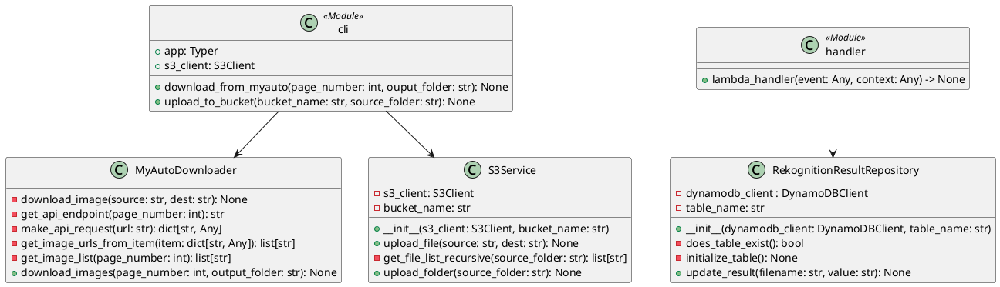

# What Is This?

This is solution to "🔥🔥🔥" assignment from Business and Technology University's "Automating Cloud Systems With Python" course.

# How to Deploy And Use?

```bash
# install dependencies for serverless framework
npm install

# create virtual environment and setup python dependencies
python3 -m venv .venv
source ./.venv/bin/activate
pip install -r requirements.txt

# setup environment variables for authentication
export AWS_ACCESS_KEY_ID="..."
export AWS_SECRET_ACCESS_KEY="..."
export AWS_SESSION_TOKEN="..."

# select role to assume
export LAB_ROLE_ARN="arn:aws:iam::..."

# deploy lambda handler using serverless
npx serverless deploy
```

There is a limitation with serverless framework, it will attempt to create IAM roles when function is configured as a listener for S3 events.
Since `LabRole` under AWSAcademy doesn't allow students to create new roles. You must do the following:
* Create an S3 bucket
* Add trigger to deployed lambda function for `s3:ObjectCreated:*` events for the bucket you created.

Note that if you are using python version other than 3.13 of python you may encounter an error when deploying with `serverless-requirements-plugin`. to resolve it you have 2 options:
* install python 3.13 and use it instead
* change python runtime version in serverless.yaml and attempt to deploy, this is not guaranteed to work since this code was tested with 3.13 version of python

# How to Use the CLI?

```bash
# activate environment
source ./.venv/bin/activate

# mark cli.py as executable
chmod +x ./cli.py

# see commands that cli supports

./cli.py --help
```

# Example usage

```bash
mkdir ./car_images/
./cli.py download-from-myauto 1 ./car_images/
./cli.py upload-to-bucket some-s3-bucket ./car_images/
```

if you have deployed the lambda handler and have the handler connected to the s3 bucket you are uploading to,
then you will see AWS Rekognition results for each file in `rekognitionAnalysesDB` table in DynamoDB

# Architecture Overview

